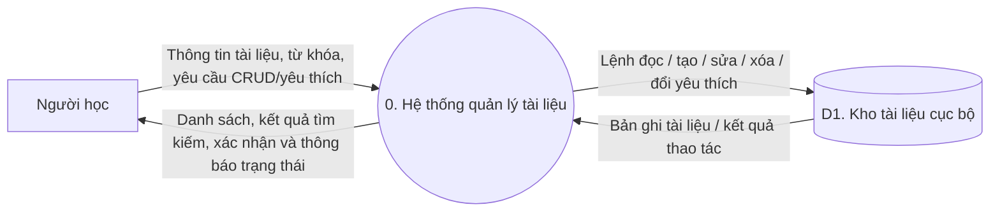
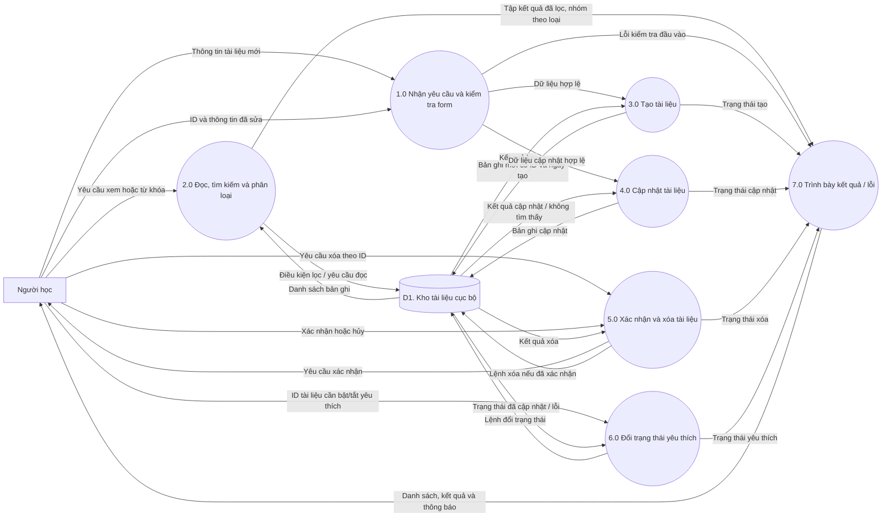

# Đặc tả yêu cầu: Quản lý tài liệu học tập

> Trạng thái: Draft
> Phạm vi: ứng dụng Cashew Study Hub
> Căn cứ: README, kiến trúc phân lớp, màn hình tài liệu, controller, use case và
> các repository lưu trữ hiện có.

## Scope Baseline

- **Phương pháp khảo sát**: đối chiếu các luồng UI với domain use case và
  repository SQLite/localStorage; tham khảo [README](../README.md) và
  [ARCHITECTURE](../ARCHITECTURE.md).
- **Số nhóm chức năng nhận diện**: 6 — tạo tài liệu, xem/phân loại danh sách,
  tìm kiếm, chỉnh sửa, xóa, và đánh dấu yêu thích.
- **Số nhóm trong phạm vi**: 6 — đây là các luồng quản lý tài liệu hiện có.
- **Ngoài phạm vi**: đăng nhập/phân quyền, chia sẻ đồng bộ nhiều người dùng,
  tải file lên máy chủ, chọn file từ thiết bị, và mở URL/file trực tiếp.

## User Scenarios & Testing

### User Story 1 — Tạo và xem tài liệu (Priority: P1)

Là người học, tôi muốn lưu tài liệu với tên, loại, định dạng, link/đường dẫn và
thông tin môn học để tìm lại tài liệu sau này.

**Lý do ưu tiên**: lưu và xem tài liệu là giá trị cốt lõi của ứng dụng.

**Kiểm thử độc lập**: tạo một tài liệu hợp lệ, tải lại danh sách và xác nhận
tài liệu vẫn được hiển thị trong nhóm loại tương ứng.

**Kịch bản chấp nhận**:

1. **Given** người dùng đang ở danh sách tài liệu, **When** nhập tên và định
   dạng hợp lệ rồi lưu, **Then** tài liệu mới xuất hiện trong danh sách và được
   gán một mã định danh.
2. **Given** người dùng bỏ trống tên hoặc định dạng bắt buộc, **When** gửi form,
   **Then** dữ liệu không được lưu và form hiển thị thông báo cần nhập.
3. **Given** dữ liệu đã được lưu, **When** mở lại ứng dụng, **Then** tài liệu
   vẫn có trong danh sách.

### User Story 2 — Tìm kiếm và lọc tài liệu (Priority: P1)

Là người học, tôi muốn tìm theo tên, loại, định dạng hoặc môn học và xem theo
nhóm để nhanh chóng định vị tài liệu.

**Lý do ưu tiên**: tìm kiếm là luồng chính để khai thác danh sách đã lưu.

**Kiểm thử độc lập**: nhập một phần tên/loại/định dạng/môn học; xác nhận kết quả
phù hợp và các kết quả không khớp bị ẩn.

**Kịch bản chấp nhận**:

1. **Given** danh sách có nhiều tài liệu, **When** nhập từ khóa khớp tên hoặc
   loại, **Then** chỉ tài liệu khớp được hiển thị trong tab phù hợp.
2. **Given** đang có từ khóa tìm kiếm, **When** xóa từ khóa, **Then** danh sách
   đầy đủ được khôi phục.
3. **Given** từ khóa không khớp tài liệu nào trong tab, **When** hiển thị kết
   quả, **Then** ứng dụng thông báo danh sách trống cho tab đó.

### User Story 3 — Chỉnh sửa và xóa tài liệu (Priority: P1)

Là người học, tôi muốn cập nhật thông tin tài liệu hoặc xóa tài liệu không còn
cần thiết để danh sách phản ánh dữ liệu hiện tại.

**Lý do ưu tiên**: dữ liệu phải có thể duy trì, không chỉ được tạo một lần.

**Kiểm thử độc lập**: sửa một trường, tải lại và kiểm tra thay đổi; sau đó yêu
cầu xóa, xác nhận xóa và kiểm tra tài liệu biến mất.

**Kịch bản chấp nhận**:

1. **Given** một tài liệu đã lưu, **When** người dùng sửa thông tin và lưu,
   **Then** cùng tài liệu đó được cập nhật, không tạo bản ghi mới.
2. **Given** người dùng chọn xóa, **When** hộp thoại xác nhận xuất hiện và
   người dùng chọn hủy, **Then** dữ liệu không thay đổi.
3. **Given** người dùng xác nhận xóa, **When** thao tác lưu hoàn tất, **Then**
   tài liệu bị loại khỏi kho và không còn trong danh sách.

### User Story 4 — Quản lý yêu thích (Priority: P2)

Là người học, tôi muốn bật/tắt dấu yêu thích trên tài liệu để nhận biết tài liệu
ưu tiên.

**Lý do ưu tiên**: tăng khả năng tổ chức danh sách nhưng không ngăn cản CRUD cơ
bản.

**Kiểm thử độc lập**: bật/tắt yêu thích và xác nhận trạng thái còn nguyên sau
khi tải lại.

**Kịch bản chấp nhận**:

1. **Given** tài liệu đang chưa yêu thích, **When** bật yêu thích, **Then** biểu
   tượng chuyển sang trạng thái yêu thích và trạng thái được lưu.
2. **Given** tài liệu đang yêu thích, **When** bỏ yêu thích, **Then** trạng thái
   được tắt và lưu.

### Trường hợp biên

- Truy vấn tìm kiếm chỉ có khoảng trắng được xem như truy vấn rỗng.
- Lỗi đọc/ghi hoặc bản ghi không còn tồn tại phải được báo cho người dùng; không
  hiển thị thao tác thất bại như thể đã thành công.
- URL/đường dẫn rỗng được chấp nhận vì form hiện không bắt buộc nguồn tài liệu.
- Nếu category trong kho không hợp lệ, việc đọc dữ liệu hiện tại có thể lỗi;
  dữ liệu ghi mới cần luôn dùng một trong ba loại hợp lệ.
- Khi hai tài liệu có cùng tên, mỗi tài liệu vẫn được phân biệt bằng ID.

## Requirements

### Functional Requirements

- **REQ-001**: Ứng dụng phải cho phép tạo tài liệu với tên và định dạng bắt buộc,
  cùng loại, link/đường dẫn, môn học và mô tả tùy chọn.
- **REQ-002**: Ứng dụng phải gán ID và thời điểm tạo cho tài liệu mới, lưu tài
  liệu bền vững và đọc lại được sau khi ứng dụng khởi động lại.
- **REQ-003**: Ứng dụng phải hiển thị tài liệu theo ba loại: Bài giảng, Bài tập
  và Tài liệu tham khảo.
- **REQ-004**: Ứng dụng phải tìm kiếm không phân biệt hoa thường theo tên, nhãn
  loại, định dạng và môn học; từ khóa rỗng phải trả lại toàn bộ kết quả.
- **REQ-005**: Ứng dụng phải cho phép chỉnh sửa các trường của tài liệu đã lưu
  mà không đổi ID, thời điểm tạo và trạng thái yêu thích hiện có.
- **REQ-006**: Ứng dụng phải yêu cầu xác nhận trước khi xóa; chỉ xóa khỏi kho
  khi người dùng xác nhận.
- **REQ-007**: Ứng dụng phải cho phép bật/tắt và lưu trạng thái yêu thích của
  tài liệu.
- **REQ-008**: Mọi thao tác nghiệp vụ CRUD và yêu thích phải đi qua domain use
  case/repository contract trước khi đến kho dữ liệu; giao diện không truy cập
  trực tiếp SQLite hoặc localStorage.
- **REQ-009**: Ứng dụng phải thông báo khi tải hoặc ghi dữ liệu thất bại và cung
  cấp cách thử tải lại khi danh sách không thể đọc.

### Yêu cầu phi chức năng

- **NFR-001**: Với tối đa 1.000 tài liệu đã lưu, danh sách và kết quả lọc phải
  sẵn sàng trong không quá 2 giây trên thiết bị hỗ trợ mục tiêu.
- **NFR-002**: Các thao tác thành công/thất bại phải cho phản hồi rõ ràng; không
  được âm thầm bỏ qua lỗi lưu trữ.
- **NFR-003**: Cùng một bộ yêu cầu nghiệp vụ phải dùng được trên mobile, desktop
  và Web; khác biệt kho lưu trữ không làm thay đổi kết quả CRUD.

### Thực thể chính

- **StudyDocument**: tài liệu học tập; gồm ID, tên, môn học, loại, mô tả, định
  dạng file, link/đường dẫn, thời điểm tạo và trạng thái yêu thích.
- **StudyDocumentCategory**: loại tài liệu; có ba giá trị Bài giảng, Bài tập và
  Tài liệu tham khảo.
- **DocumentCollection**: tập tài liệu người dùng quản lý. Trong phạm vi hiện
  tại là một tập cục bộ, chưa có chủ sở hữu/người dùng đăng nhập.

## Thiết kế sơ đồ luồng dữ liệu

Ký hiệu: hình chữ nhật là tác nhân ngoài, hình tròn/tiến trình là xử lý, hình
trụ là kho dữ liệu, mũi tên là dữ liệu đi qua. DFD mô tả luồng logic, không mô
tả chi tiết widget hoặc lớp triển khai.

### DFD mức 0 — Sơ đồ ngữ cảnh

### DFD mức 1 — Phân rã tiến trình

### Đối chiếu DFD với kiến trúc hiện tại

| Tiến trình DFD | Thành phần xử lý tương ứng | Kho dữ liệu |
|---|---|---|
| 1.0 Kiểm tra form | `DocumentFormPage` | — |
| 2.0 Đọc/tìm kiếm/phân loại | `DocumentListController`, `GetDocuments`, `SearchDocuments` | `SqliteDocumentRepository` hoặc `PreferencesDocumentRepository` |
| 3.0 Tạo | `DocumentListController`, `CreateDocument` | Repository theo nền tảng |
| 4.0 Cập nhật | `DocumentListController`, `UpdateDocument` | Repository theo nền tảng |
| 5.0 Xóa | `StudyHomePage`, `DeleteDocument` | Repository theo nền tảng |
| 6.0 Yêu thích | `ToggleDocumentFavorite` | Repository theo nền tảng |
| D1 Kho tài liệu cục bộ | — | SQLite mobile/desktop; localStorage trên Web |

## Giả định và giới hạn

- Ứng dụng phục vụ một người dùng cục bộ, chưa có xác thực hoặc phân quyền.
- Link/đường dẫn chỉ được lưu dưới dạng chuỗi; ứng dụng hiện chưa chọn file,
  upload, tải về hoặc mở tài nguyên đó.
- Ba loại tài liệu là danh mục cố định trong phiên bản hiện tại.
- DFD dùng một kho logic D1 để không gắn nghiệp vụ với SQLite hay localStorage;
  triển khai vật lý khác nhau theo nền tảng.

## Tiêu chí thành công

- **SC-001**: Người dùng có thể tạo và nhìn thấy tài liệu hợp lệ trong tối đa 5
  thao tác sau khi mở form.
- **SC-002**: Với tối đa 1.000 tài liệu, ít nhất 95% thao tác tìm kiếm trả kết
  quả trong vòng 2 giây.
- **SC-003**: Người dùng có thể sửa thông tin và xác nhận xóa mà không làm thay
  đổi nhầm tài liệu khác trong các kịch bản kiểm thử CRUD.
- **SC-004**: 100% thao tác CRUD/yêu thích trong bộ kiểm thử chấp nhận đi qua
  đường xử lý domain và cho kết quả nhất quán trên kho dữ liệu được kiểm thử.
- **SC-005**: Mọi lỗi đọc/ghi được hiển thị dưới dạng thông báo có thể nhận biết;
  không có lỗi lưu trữ nào bị báo thành công.
